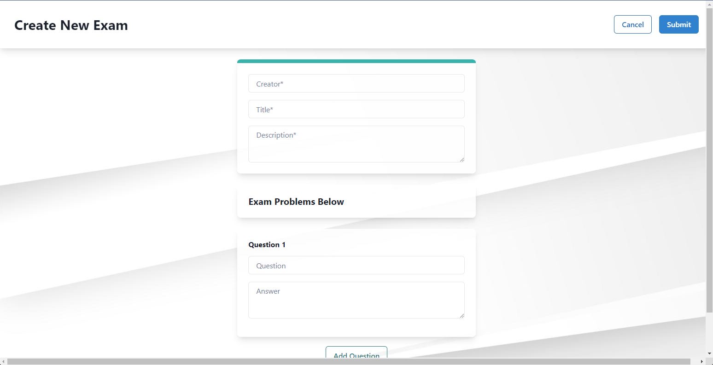
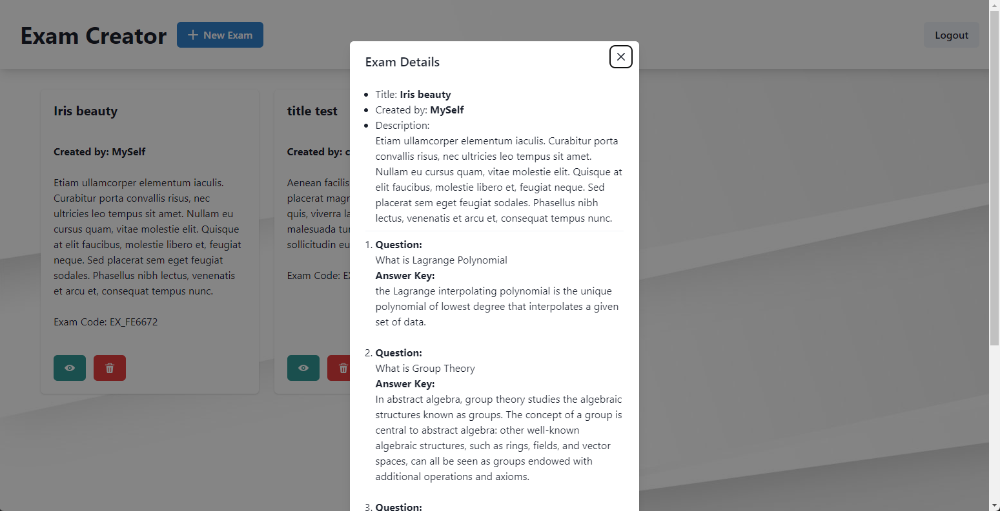
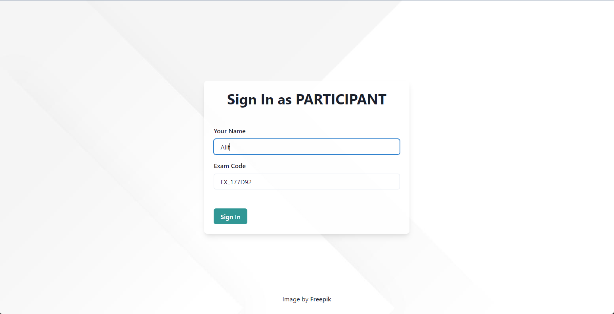
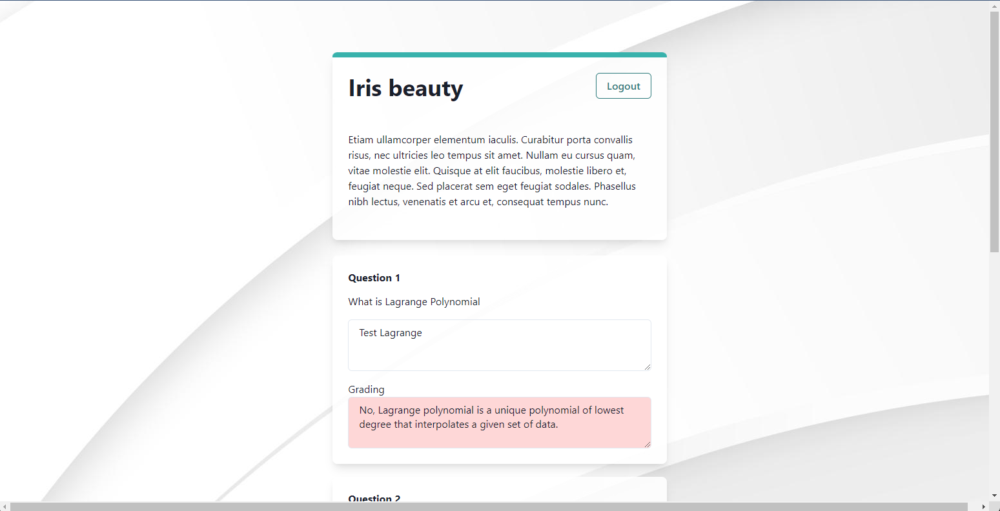

# auto-grader

Uses Openai ChatGPT for autograding answers of a question based inputed question and the answer key

## Screenshots

- Create new exam
  

- View question detail
  
 
- Sign in using Exam Code
  
  
- Auto grading
  
  
  
